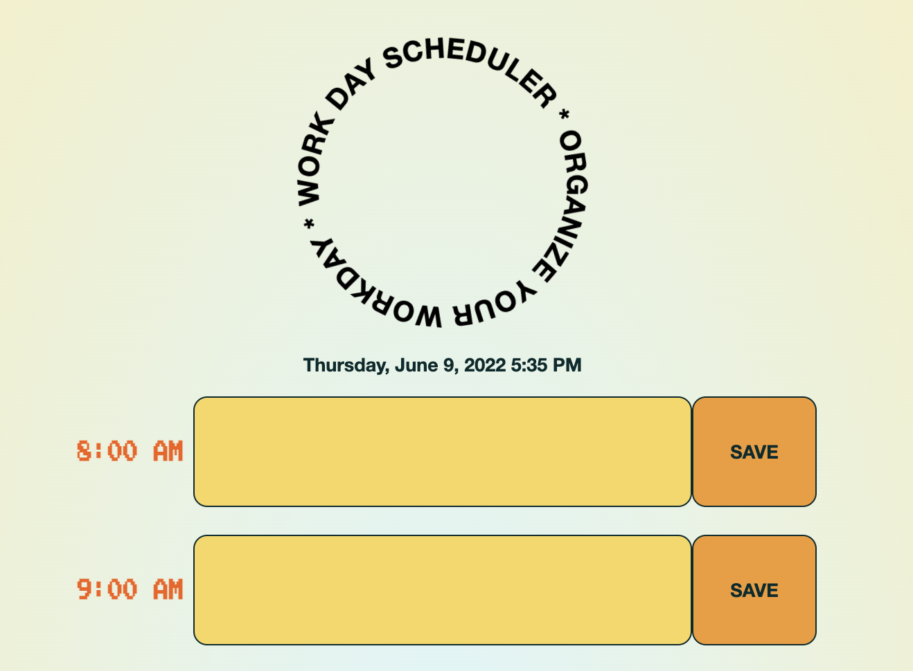
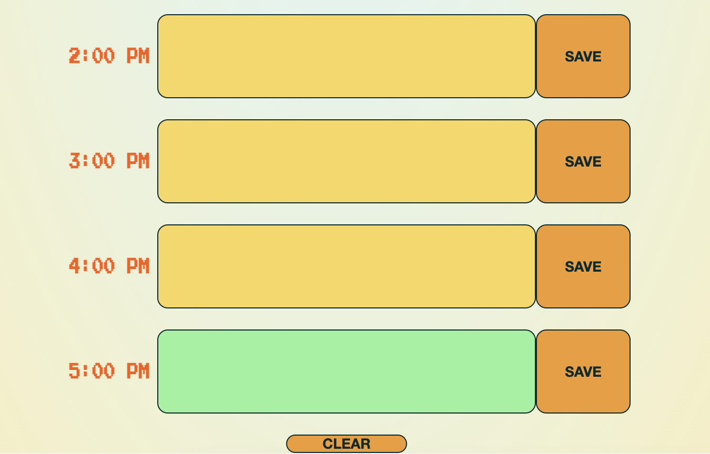

# Work Day Scheduler
A simple Calendar tool to allow users to organize their workday hour to hour. The calendar uses local storage to show the user past entries, and features a clear button to erase entries no longer relevant. 

## Live 
[WorkDay Scheduler Live](https://3lydaley.github.io/workScheduler/)

## Table of Contents
* [General Info](#general-information)
* [Technologies Used](#technologies-used)
* [Features](#features)
* [Screenshots](#screenshots)
* [Project Status](#project-status)
* [Acknowledgements](#acknowledgements)
* [Contact](#contact)

## General Information

USER STORY: 

AS AN employee with a busy schedule
I WANT to add important events to a daily planner
SO THAT I can manage my time effectively

----------------------

This project is expected to provide a daily planner for scheduling. The current day and time is present at the top of the page, and the time blocks represent standard business hours, color coded for past, present, and future. When any time block is clicked, the user is able to enter an event and save it to that time block. The text is saved in local storage to persist when the page is reloaded.   

## Technologies Used
- Tech 1 - HTML5
- Tech 2 - JavaScript
- Tech 3 - CSS
- Tech 4 - JQuery
- Tech 5 - Bootstrap
- Tech 6 - VS code
- Tech 7 - Moment.js

## Features
List the ready features here:
- Calendar divided by hour, whose text fields change color when the hour has passed.
- Saves to Local storage so past entries will be reloaded if page is refreshed
- Can clear Local storage for a clean slate

## Screenshots

## Project Status
Project is: _in review_ 

## Acknowledgements
Give credit here.
- Many thanks to W3 School's tutorials, Stack Overflow, Github repos, and JQuery documentation for the many questions you have answered.

## Contact
Created by [@3lydaley](https://github.com/3lyDaley) - feel free to contact me!
